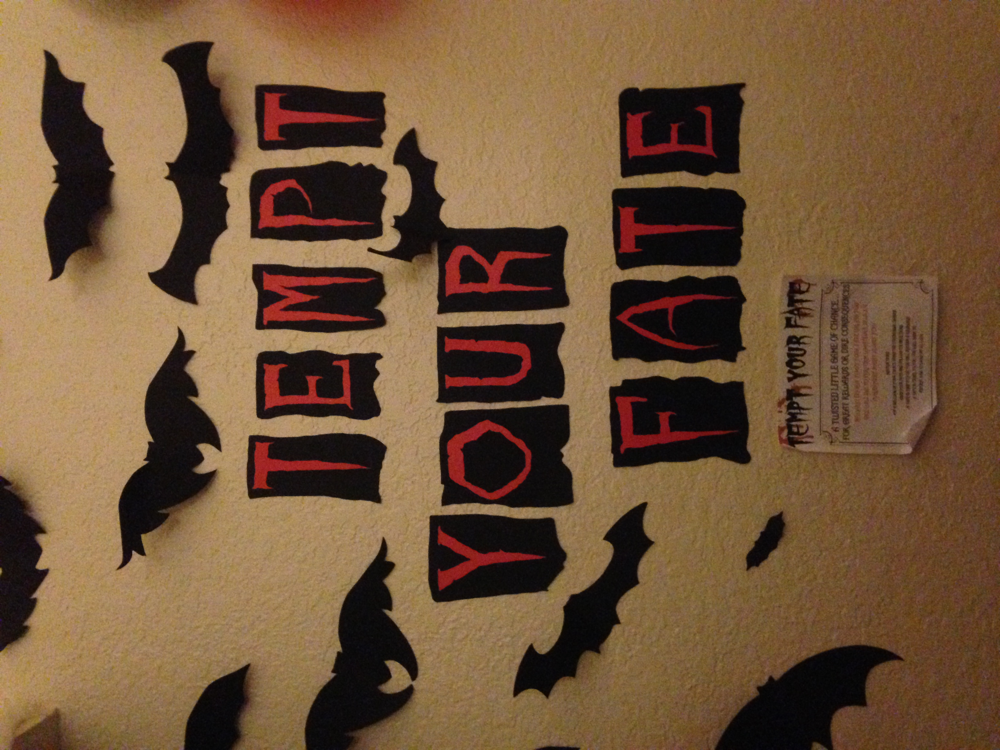

<html>
    <head>
        <meta charset="utf-8">
        <meta http-equiv="X-UA-Compatible" content="IE=edge,chrome=1">

        <title>Tinker CSS Template</title>
        <meta name="description" content="">
        <meta name="viewport" content="width=device-width, initial-scale=1">
        
        <link href="https://fonts.googleapis.com/css?family=Open+Sans:300,400,600,700,800" rel="stylesheet">
        <link href="https://fonts.googleapis.com/css?family=Roboto:100,300,400,500,700,900" rel="stylesheet">
        
        <link rel="apple-touch-icon" href="apple-touch-icon.png">

        <link rel="stylesheet" href="css/bootstrap.min.css">
        <link rel="stylesheet" href="css/bootstrap-theme.min.css">
        <link rel="stylesheet" href="css/fontAwesome.css">
        <link rel="stylesheet" href="css/hero-slider.css">
        <link rel="stylesheet" href="css/owl-carousel.css">
        <link rel="stylesheet" href="css/templatemo-style.css">
        <link rel="stylesheet" href="css/lightbox.css">

        
    </head>

<body>
    

        

            <nav class="navbar navbar-inverse" role="navigation">
                

                    <button type="button" id="nav-toggle" class="navbar-toggle" data-toggle="collapse" data-target="#main-nav">
                        Toggle navigation
                        
                        
                        
                    </button>
                    <a href="#" class="navbar-brand scroll-top"><em>T</em>inker</a>
                

                <!--/.navbar-header-->
                

                    <ul class="nav navbar-nav">
                        <li><a href="#" class="scroll-top">Home</a></li>
                        <li><a href="#" class="scroll-link" data-id="about">Learn More</a></li>
                        <li><a href="#" class="scroll-link" data-id="portfolio">Gallery</a></li>
                        <li><a href="#" class="scroll-link" data-id="blog">Map</a></li>
                        <li><a href="#" class="scroll-link" data-id="contact-us">Contact Us</a></li>
                    </ul>
                

                <!--/.navbar-collapse-->
            </nav>
            <!--/.navbar-->
        

        <!--/.container-->
    

    <!--/.header-->

    

        

            

                <h2>COSTUMES & COCKTAILS <em>2017</em></h2>
                
Phasellus aliquam finibus est, id tincidunt mauris fermentum a. In elementum diam et dui congue, ultrices bibendum mi lacinia. Aliquam lobortis dapibus nunc, nec tempus odio posuere quis. 

                

                    <a href="#" class="scroll-link" data-id="about">Let's Start</a>
                

            

        

    

<!-- LEARN MORE -->

    

        

            

                

                    

                        

                            <h4>Learn More</h4>
                            

                            
Need more details about Costumes & Cocktails?

                            <ul class="tabs clearfix" data-tabgroup="first-tab-group">
                                <li><a href="#tab1" class="active">Description</a></li>
                                <li><a href="#tab2">Date & Time</a></li>
                                <li><a href="#tab3">Games</a></li>
                                <li><a href="#tab4">Bring a Drink</a></li>
                            </ul>
                        

                    

                    

                        <section id="first-tab-group" class="tabgroup">
                            

                                
                                

                                    <h4>Description</h4>
                                    
We're so happy we could SCREAM! 
                                        Why? Because it's Halloween! 
                                        Our crypt is ready and it's a scary sight, 
                                        filled with frightening creatures of the night. 

                                        Enter the graveyard if you dare. 
                                        Go past the ghosts to the Demon's lair. 
                                        If you are strong and brave and bold, 
                                        accept this summons, you now hold. 

                                        Be here by 8:00 and meet your fate; 
                                        Wear your wildest costume and bring your tastiest date! 
                                        There will be Mayhem, Munchies, & Witch's Brew, 
                                        To make it complete, we just need you.... and some extra alcohol! 

                                        Costumes & Cocktails is back. Come on over and have a scary good time! Please bring an alcoholic                                         beverage or snack (if you don't know what to bring, just ask). We're DYING to have you......

                                

                            

                            

                                
                                

                                    <h4>Date & Time</h4>
                                    
 Saturday 
                                    October 28th 
                                    8PM

                                

                            

                            

                                
                                

                                    <h4>Games</h4>                                 
                                    
The chance to Tempt Your Fate awaits you at Costumes and Cocktails. 
                                    Or if you're not brave enough to challenge fate, try a spin at the Wheel of Intoxication.

                                

                            

                            

                                
                                

                                    <h4>Bring a Drink</h4>
                                    
Costumes & Cocktails is an expensive venture. We ask that everyone pitches in with a drink or 
                                    small dish. Contact your hosts for suggestions.
 
                                

                            

                        </section>
                    

                

            

        

    

    
    
    
<!-- GALLERY -->

    <section id="portfolio">
        

            

                

                    

                        

                            <h4>Gallery</h4>
                            

                            
Take a look back at pictures from previous years.

                            

                                <ul class="project-filter">
                                    <li class="filter" data-filter="all">Show All</li>
                                    <li class="filter" data-filter="2014">2014</li>
                                    <li class="filter" data-filter="graphic">2015</li>
                                    <li class="filter" data-filter="nature">2017 (Coming Soon)</li>                         
                                </ul>
                            

                        

                    

                    

                        

                            

                                

                                    

                                      

                                            

                                                
                                            

                                      

                                    

                                    

                                      

                                        

                                                
                                            

                                      

                                    

                                    

                                      

                                            

                                                
                                            

                                      

                                    

                                    

                                        

                                            

                                                
                                            

                                        

                                    

                                    

                                      

                                            

                                                
                                            

                                      

                                    

                                    

                                        

                                            

                                                
                                            

                                        

                                    

                                

                            

                        

                    

                

            

        
 
    </section>

    <section id="testimonial">
        

            

                

                    

                        

                            

                                
“ Vivamus cursus at est in gravida. Phasellus semper est quis tellus viverra consectetur eget sed leo. Quisque consectetur tempor cursus. Nullam ut mauris fermentum, pretium risus id, tincidunt ante. ”

                                <h4>George Rich</h4>
                                Web Designer
                            

                        

                        

                            

                                
“ Phasellus orci nisi, varius sed lacinia et, pulvinar quis est. Curabitur a tincidunt tortor. Cras rhoncus sodales massa sagittis malesuada. Nulla maximus vitae lorem vel elementum. ”

                                <h4>John Henry</h4>
                                New Manager
                            

                        

                        

                            

                                
“ Phasellus aliquam finibus est, id tincidunt mauris fermentum a. In elementum diam et dui congue, ultrices bibendum mi lacinia. Aliquam lobortis dapibus nunc, nec tempus odio posuere quis. ”

                                <h4>Danny Cute</h4>
                                CEO Founder
                            

                        

                        

                            

                                
“ Quisque ut ligula venenatis, euismod risus vel, consequat lacus. In ut purus id felis euismod cursus. Praesent in pulvinar arcu, vitae hendrerit lectus. Quisque a urna magna. ”

                                <h4>Richard Beal</h4>
                                CSS Developer
                            

                        

                    

                

            

        

    </section>

    

        

            

                

                    

                        <h4>Contact Us</h4>
                        

                        
Donec sit amet commodo arcu. Sed sit amet iaculis mi, vel fermentum nisi. Morbi dui enim, vestibulum non accumsan ac, tempor non nisl.

                        

                            <h4>Send us a message</h4>
                        

                    

                

            

            

                

                    

                        ✖
                        <form id="contact" action="#" method="post">
                            

                                

                                  <fieldset>
                                    <input name="name" type="text" class="form-control" id="name" placeholder="Your name..." required="">
                                  </fieldset>
                                

                                

                                  <fieldset>
                                    <input name="email" type="email" class="form-control" id="email" placeholder="Your email..." required="">
                                  </fieldset>
                                

                                

                                  <fieldset>
                                    <textarea name="message" rows="6" class="form-control" id="message" placeholder="Your message..." required=""></textarea>
                                  </fieldset>
                                

                                

                                  <fieldset>
                                    <button type="submit" id="form-submit" class="btn">Send Message</button>
                                  </fieldset>
                                

                            

                        </form>
                    

                

            

        

    

    

    	<!-- How to change your own map point
            1. Go to Google Maps
            2. Click on your location point
            3. Click "Share" and choose "Embed map" tab
            4. Copy only URL and paste it within the src="" field below
        -->
        <iframe src="https://www.google.com/maps/embed?pb=!1m18!1m12!1m3!1d3119.250817622368!2d-121.42031498436819!3d38.57407157354195!2m3!1f0!2f0!3f0!3m2!1i1024!2i768!4f13.1!3m3!1m2!1s0x809ada5ea6d84b57%3A0xbeec8de83cc2b47!2s25+Cadillac+Dr%2C+Sacramento%2C+CA+95825!5e0!3m2!1sen!2sus!4v1508442393021" width="100%" height="450" frameborder="0" style="border:0" allowfullscreen></iframe>
    

    <footer>
        

            

                

                    

                        <a href="#" class="scroll-top">Costumes & Cocktails</a>
                        
Design: Mallory & Joe

                    

                

               

                    

                        <h4>Location</h4>
                        <ul>
                        <li>37 Cadillac Drive Apt. #52 </li>
                        <li>Sacramento, CA 95825 </li>
                       </ul>
                    

                

                

                    

                        <h4>Contact</h4>
                        <ul>
                            <li><em>Mallory</em>: (916)601-4486</li>
                            <li><em>Joe</em>: (818)679-2223</li>
                        </ul>
                    

                

                

                    

                        <h4>RSVP</h4>
                        <ul>
                            <li><a href="https://www.facebook.com/templatemo" target="_parent"><i class="fa fa-facebook"></i></a></li>
                            <li><a href="https://www.google.com/+templatemo" target="_blank"><i class="fa fa-twitter"></i></a></li>
                        </ul>
                    

                

            

        

    </footer>

    
    

    

    
    

    
    
</body>
</html>
